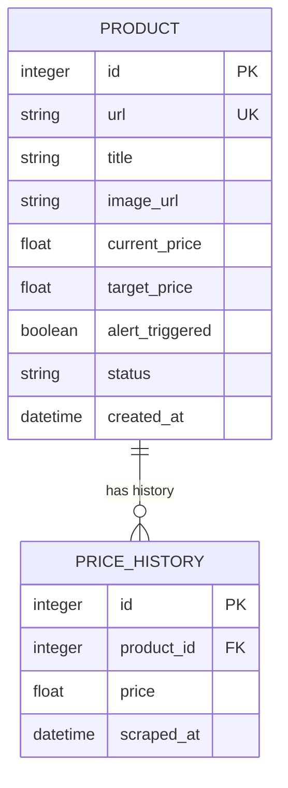

# Database Schema & Data Models

This document defines the schema structure and python object relational mappings (SQLModel) for the SQLite database.

---

## 1. Entity Relationship Diagram (ERD)



---

## 2. Table Definitions

### Table: `products`
Stores product tracking configuration and the latest scraped details.

| Column | Type | Constraints | Description |
| :--- | :--- | :--- | :--- |
| `id` | `INTEGER` | `PRIMARY KEY`, `AUTOINCREMENT` | Unique identifier |
| `url` | `VARCHAR` | `UNIQUE`, `NOT NULL` | Direct product URL |
| `title` | `VARCHAR` | `NOT NULL` | Product title scraped from DOM |
| `image_url` | `VARCHAR` | | Absolute URL for product thumbnail |
| `current_price` | `FLOAT` | `NOT NULL` | Most recently scraped price |
| `target_price` | `FLOAT` | `NOT NULL` | Alert threshold price |
| `alert_triggered`| `BOOLEAN` | `DEFAULT FALSE` | True if alert was sent for current dip |
| `status` | `VARCHAR` | `DEFAULT 'Active'` | Status: `Active`, `Triggered`, `Error` |
| `created_at` | `DATETIME` | `DEFAULT CURRENT_TIMESTAMP`| Timestamp when tracking started |

### Table: `price_history`
Stores historic price records for line chart plotting.

| Column | Type | Constraints | Description |
| :--- | :--- | :--- | :--- |
| `id` | `INTEGER` | `PRIMARY KEY`, `AUTOINCREMENT` | Unique history record ID |
| `product_id` | `INTEGER` | `FOREIGN KEY (products.id)`, `ON DELETE CASCADE` | Product relationship |
| `price` | `FLOAT` | `NOT NULL` | Scraped price value |
| `scraped_at` | `DATETIME` | `DEFAULT CURRENT_TIMESTAMP` | Timestamp of scraping event |

---

## 3. SQLModel Declarations (Python Code)

```python
from datetime import datetime
from typing import List, Optional
from sqlmodel import Field, Relationship, SQLModel

class ProductBase(SQLModel):
    url: str = Field(unique=True, index=True)
    title: str
    image_url: Optional[str] = None
    current_price: float
    target_price: float
    alert_triggered: bool = False
    status: str = "Active"

class Product(ProductBase, table=True):
    __tablename__ = "products"
    
    id: Optional[int] = Field(default=None, primary_key=True)
    created_at: datetime = Field(default_factory=datetime.utcnow)
    
    # Relationship to historical records
    history: List["PriceHistory"] = Relationship(
        back_populates="product", 
        sa_relationship_kwargs={"cascade": "all, delete-orphan"}
    )

class PriceHistoryBase(SQLModel):
    price: float
    product_id: int = Field(foreign_key="products.id")

class PriceHistory(PriceHistoryBase, table=True):
    __tablename__ = "price_history"
    
    id: Optional[int] = Field(default=None, primary_key=True)
    scraped_at: datetime = Field(default_factory=datetime.utcnow)
    
    # Relationship back to parent product
    product: Product = Relationship(back_populates="history")
```
